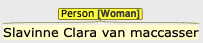
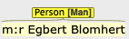
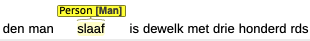
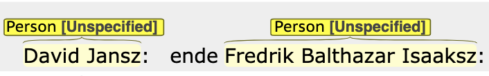
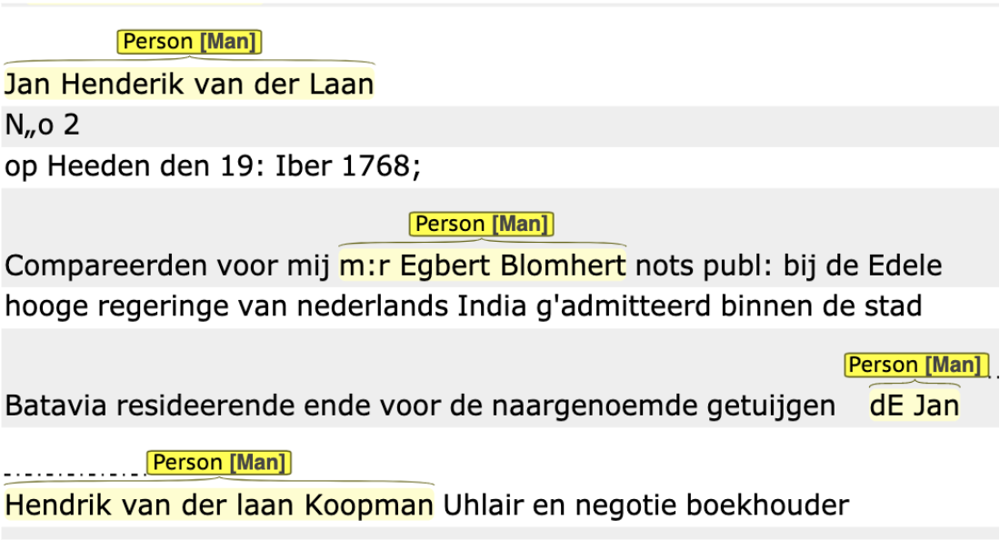

# UnSilencing the VOC Testaments

## Description of the Documents
The VOC wills in the National Archives are a small part of a much larger number of wills that ever existed. Every VOC employee was obliged to have a will drawn up (this could be done in Amsterdam, on the ships or in the VOC establishments). This was a form of efficient personnel policy so that after the death of an employee it was clear what should be done with the bequest. 

The collection in which we work is largely built up in the VOC establishments, in particular Batavia. A copy of each will was sent to the VOC headquarters in Amsterdam. After the disintegration of the VOC at the end of the 18th century, part of these copy wills have been preserved and probably only much later merged into volumes (in Dutch: banden) that are now in the custody of the National Archives. In the 19th century, archivists produced an index to these testaments indexing the name of the male testator. A few years ago these testaments were digitized and can be accessed online but the 19th century index was still the main tool to be used to access the wills.  

## Data
This project is concerned with [testaments of those employed by the VOC](https://www.nationaalarchief.nl/onderzoeken/zoekhulpen/voc-oost-indische-testamenten) now with the National Archives. These handwritten wills were recorded in Dutch in the XVII and XVIII century. These wills have been recently automatically transcribed using handwritten text recognition (HTR) technology, therefore the transcriptions might contain errors. The transcriptions have been loaded into the annotation software: BRAT, which were annotated.

## Annotation Schema
The BRAT annotation tool was used for the task of collaborative annotations. While performing annotations on BRAT, the annotators compared the transcribed documents with the actual scans which can be found on the website of the Nationaal Archief (link) due to the errors in the transcription. Find below a brief explanation of the kind of named entities used in the annotation schema. 

### Person
This entity category refers to persons. It may refer to both individuals as well as groups of people. When tagging a piece of text as a “Person”, title of the person is included as well when available. In case only the title is mentioned, mark that as a person as well.

Persons have three kinds of attributes: Gender, Role and Legal Status

#### Gender
is categorised as:
* Man
* Woman
* Group
* Unspecified

In general we are interested in tagging persons with the mentioned proper name. If the name is followed or led by an identifier which reveals their gender, we shall mark the identifier and the name. Consider these examples:

The exception is made only in the case of enslaved or formerly enslaved persons — tag such references to persons even when not followed by proper name. This is because such persons are often mentioned without name in these documents — a silencing mechanism — and are of particular interest for this research. For example:

When the leading identifier is not mentioned and only the name of a person is mentioned, we do not need to guess the gender but can leave it unspecified. 

However, in such a situation where a leading identifier does mark the gender of a person, we can continue tagging them with that gender elsewhere on the page even when it occurs without the leading identifier. For instance consider the two mentions of “Jan Hendrik van der Laan”:

#### Legal Status

* Enslaved
* Freed
* Unspecified

#### Role

* Notary
* Acting_Notary
* Testator
* Beneficiary
* Testator_Beneficiary
* Witness
* Other

### ProperName
Proper names apply for places, organizations and persons. For instance, when the name of the person is mentioned, please annotate that as well. Proper names are nested within the “Person” entity. And similarly for places and organizations.

### Organization 
Examples: Vereenigde Oost Indische Compagnie, Lutherse Kerk
Organizations refer to companies, schools, universities but also the branches of the church. In case the proper name of the organization is mentioned, please annotate that as well.

### Place 

 ### Noteworthy
 
 In case annotators encounter across a fragment of text that reveals some interesting information, please tag it under this entity. 
 
 You can additionally leave a comment under the “Note” section of any annotation. For instance the note left for the noteworthy annotation states the correct spelling, and why the annotator found the phrase noteworthy.

