# Description of the VOC Testaments

The VOC wills in the National Archives are a small part of a much larger collection of wills that ever existed. Every VOC employee was obliged to have a will drawn up (this could be done in Amsterdam, on the ships or in the VOC establishments). This was a form of efficient personnel policy so that after the death of an employee it was clear what should be done with the bequest. 

The collection in which we work is largely built up in the VOC establishments, in particular Batavia. A copy of each will was sent to the VOC headquarters in Amsterdam. After the disintegration of the VOC at the end of the 18th century, part of these copy wills have been preserved and probably only much later merged into volumes (in Dutch: banden) that are now in the custody of the National Archives. In the 19th century, archivists produced an index to these testaments indexing the name of the male testator. A few years ago these testaments were digitized and can be accessed online but the 19th century index was still the main tool to be used to access the wills.  

This project is concerned with [testaments of those employed by the VOC](https://www.nationaalarchief.nl/onderzoeken/zoekhulpen/voc-oost-indische-testamenten) now with the National Archives. These handwritten wills were recorded in Dutch in the XVII and XVIII century. These wills have been recently automatically transcribed using handwritten text recognition (HTR) technology, therefore the transcriptions might contain errors. 

# Annotation Typology

To 'unsilence' colonial archives by broadening access, more inclusive finding aids are required, encompassing all persons mentioned in the archive with emphasis on marginalized ones. Existing generic typologies for named entity recognition and classification tasks mainly focus on the high-level 'universal' or 'ubiquitous' triad *Person*, *Organization* and *Location*. **Our custom typology extends the universal triad to encompass all mentions of entities, both named and unnamed, and further qualifies them by gender, legal status, notarial roles and other relevant attributes**. 
<figure>
  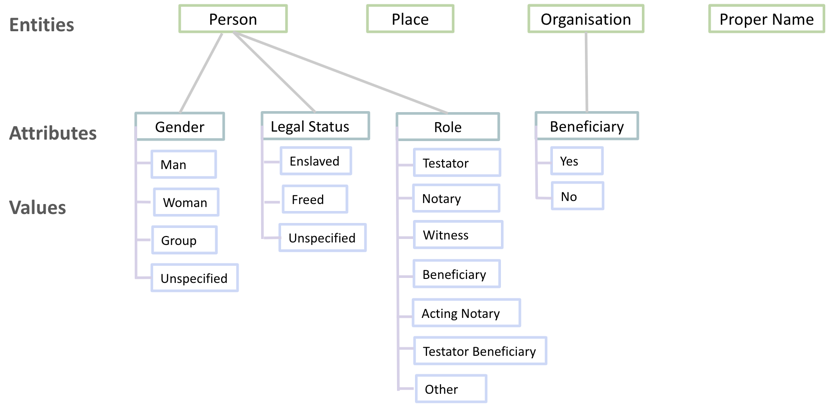
  <figcaption>
  <strong>Figure 1: </strong> Proposed Annotation Typology
  </figcaption>
</figure>

&nbsp;

Our custom typology separates the name of an entity (always tagged separately as Proper Name) from a generic reference to an entity type (Person, Place or Organization). We introduce this distinction primarily because marginalized persons are frequently mentioned in the VOC testaments, and in colonial archives more generally, without name. Instead they are referred to by a variety of terms such as “slaaf” [slave], “leiffeigenen” [serf] and “inlandse burger” [formerly enslaved persons or descendants of freed slaves]. 

## Person

The entity type Person may refer to individuals or groups of people. When annotating a text span as a person, the span should include the proper name and/or available contextual trigger words. Trigger words in this typology also include words or phrases which provide information on the gender, legal status or notarial role of the person(s). Accordingly, the entity type person has three attributes: *Gender*, *Role* and *Legal Status*. When a person is mentioned multiple times across a testament (with or without trigger words), they are annotated with the same attribute which was inferred from the presence of the trigger words.

### Gender 
When the mention of a person is followed or preceded by trigger words which reveal their gender, the text is annotated as a Person with the appropriate value of the attribute *Gender*. For each entity person, the attribute gender takes exactly one of the values from the legend in figure 2.

<figure>
  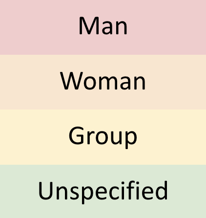
  <figcaption>
  <strong>Figure 2: </strong> Legend for labeling person-gender attribute values.
  </figcaption>
</figure>

&nbsp;
&nbsp;

When a person is mentioned without a gender trigger word, their gender is marked as *Unspecified*. This approach restricts possible ‘annotator bias’ due to unfounded inferences. Consider an instance in figure 3 below.

&nbsp;
<figure>
  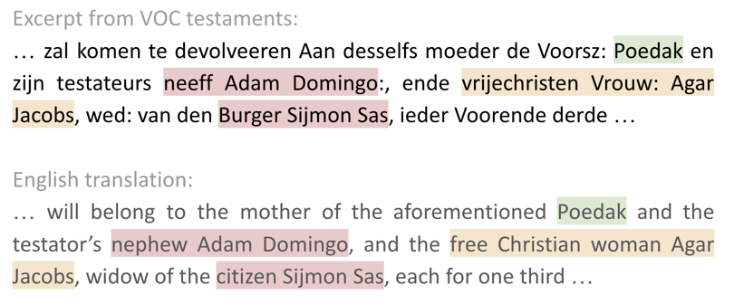
  <figcaption>
  <strong>Figure 3: </strong> Instance of annotations of genders of persons, with and without leading qualifiers.
  </figcaption>
</figure>

&nbsp;
&nbsp;

<figure>
  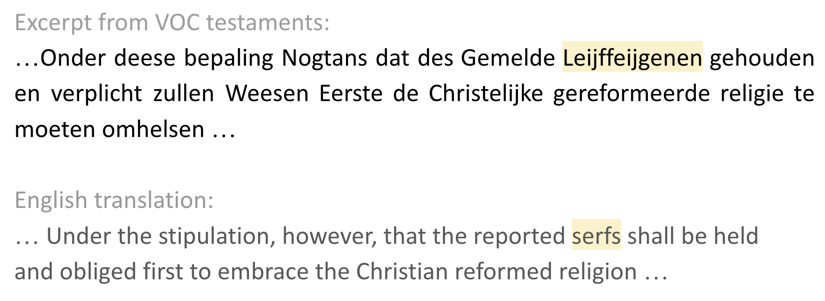
  <figcaption>
  <strong>Figure 4: </strong> Instance of an annotation of a group of persons.
  </figcaption>
</figure>

&nbsp;
&nbsp;

Persons are annotated by trigger words alone, in the absence of a proper name and in the case marginalised persons such as enslaved and formerly enslaved persons. This is because such persons are often mentioned without name and are of particular interest to our research. An example of a mention of an enslaved man without name is given in figure 5:

&nbsp;
<figure>
  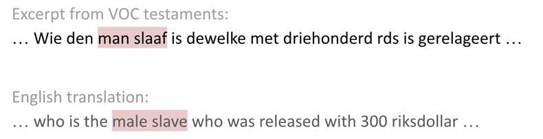
  <figcaption>
  <strong>Figure 5: </strong> Instance of an annotation of a person mentioned without name.
  </figcaption>
</figure>
&nbsp;

### Legal Status

For each entity *Person*, the attribute Legal Status takes exactly one of the values explained using the legend in the figure below:

&nbsp;
<figure>
  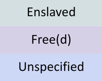
  <figcaption>
  <strong>Figure 6: </strong> Legend for tagging person-legal status attribute values.
  </figcaption>
</figure>
   

&nbsp;
<figure>
  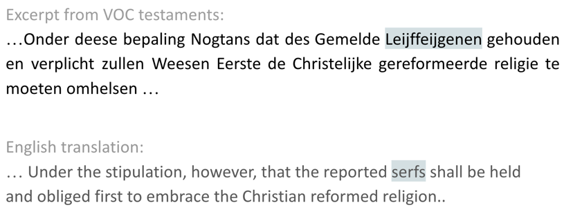
  <figcaption>
  <strong>Figure 7: </strong> Instance of an annotation of persons with legal status of enslavement.
  </figcaption>
</figure>
                                                           
&nbsp;
&nbsp;  

The attribute legal status takes the value Enslaved when the trigger words clearly identify the individual(s) to be enslaved. The attribute value *Free(d)* is often triggered by the word ‘vrije’ [free]. It refers to persons who were set free (for different reasons such as when they bought themselves free, as an act of benevolence, or for economic reasons) sometimes on the condition that they adopted the Christian religion. It could also refer to children of the manumitted slaves who, although born free, kept carrying the adjective ‘vrije’ [free], or if they were Christian they were labelled as ‘free Christian’. Finally, the adjective ‘free’ was also used for groups of free indigenous (who were never enslaved) labelled for instance as ‘vrije inlander’ [free native]. The attribute value *Free(d)* captures these three different senses of the word ‘vrije’, for which there is no clear way to clearly disambiguate among. When no trigger words are used, legal status is instead annotated as *Unspecified*.

&nbsp;
<figure>
  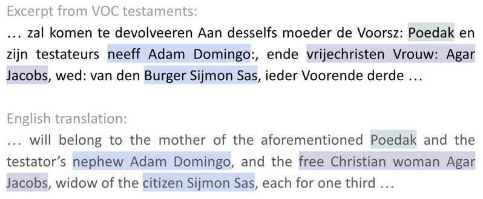
  <figcaption>
  <strong>Figure 8: </strong> Instance of annotations of the legal status of persons.
  </figcaption>
</figure>

&nbsp;

### Role

The attribute *Role* refers to roles specific to testaments in notarial archives, which may take exactly one of the following values:
* Notary
* Acting Notary
* Testator
* Beneficiary
* Testator Beneficiary
* Witness
* Other

An *Acting Notary* is a role taken on by a person who, in the absence of an officially recognized notary, performs the notarial deed as can be inferred from the extract in figure below (labelled in purple). The role *Testator Beneficiary*, instead, is attributed to those people who are both testator and beneficiary in the context of the testament. For instance, when man and wife collectively write down their testaments, each of them is a testator and often both of them are also each-other’s beneficiaries. The role *Other* is attributed to those persons whose role does not correspond to any of the six roles (for instance the annotation in orange in figure below) or when their role is not clearly mentioned.

&nbsp;
<figure>
  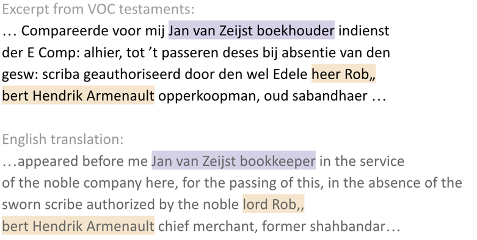
  <figcaption>
  <strong>Figure 9: </strong> Instance of annotations of an acting notary and a person with role: other.
  </figcaption>
</figure>
&nbsp;

## Place 

The entity *Place* is used to annotate places or locations.

&nbsp;
<figure>
  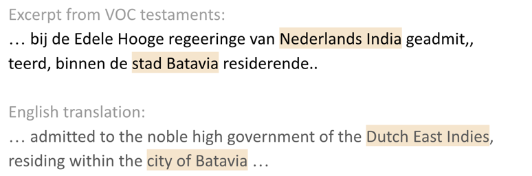
  <figcaption>
  <strong>Figure 10: </strong> Instances of annotations of places.
  </figcaption>
</figure>
&nbsp;

## Organization

This entity, as the name suggests, refers to organizations such as companies, orphanages, religious institutions and other branches of the church. Organizations have the attribute *Beneficiary* which can take the value *Yes* or *No* depending on whether the testator decides an organization to be their beneficiary. 

&nbsp;
<figure>
  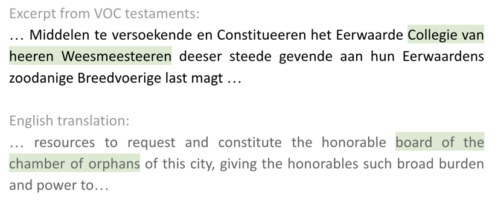
  <figcaption>
  <strong>Figure 11: </strong> Instance of an annotation of an organization.
  </figcaption>
</figure>
&nbsp;

## Proper Name 

The entity *Proper Name* refers to names (proper nouns) of the other entities in this typology: *Person*, *Place* and *Organization*. In the figure below proper names are annotated in pink, which can be compared with Figure 3 and Figure 8 where the same excerpt is labeled using the entity person and attributes gender and legal status respectively. In our dataset, annotations overlap.

<figure>
  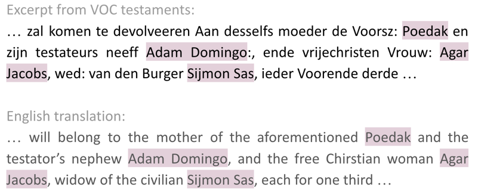
  <figcaption>
  <strong>Figure 12: </strong>Instance of Annotations of proper names.
  </figcaption>
</figure>

[//]: # (## Noteworthy)
 
When annotators encounter a fragment of text that reveals some interesting information, it is tagged under this entity. Additionally a comment may be left under the “Note” section of any annotation. For instance the note left for the noteworthy annotation may state the correct spelling, and why the annotator found the phrase noteworthy.)

<figure>
  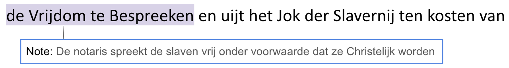
  <figcaption>
  <strong>Figure 13: </strong>Instance of Annotations of proper names.
  </figcaption>
</figure>

## TranscriptionError_Document
Sometimes certain documents are scanned with overlaps, thus leading to incorrect transcriptions. All entities are annotated on such pages, and a single "TranscriptionError_Document" entity is annotated on such pages. 

## DuplicatePage 
Sometimes certain documents are scanned with overlaps or multiple times, thus leading to incorrect transcriptions and duplicate pages. All entities are annotated on such pages, and a single "DuplicatePage" entity is annotated on such pages. 

# Data

The corpus consists of 2183 unique pages, plus 307 duplicated ones (for calculating the Inter-Annotator Agreement), resulting in a total of 2490 pages.
Total number of annotations is 68,416 of which 32,203 at the entity level (47%) and 36,213 at the attribute level (53%). 

**Entity Type**|**Number of Annotations**|**Percentage over Total**|
-------------- | ----------------------- | ----------------------- |
Person         | 11,700                  | 36.3 %                  | 
Place          | 4,522                   | 14.0 %                  |
Organization   | 1,113                   | 3.5%                    |
Proper Name    | 14,868                  | 46.2%                   |
**Total**      | **33,203**              | **100%**                |

Total number of annotated tokens is 79,715 more details given in table below:

**Entity Type**|**Number of Tokens**     |**Average per Annotation**|
-------------- | ----------------------- | ------------------------ |
Person         | 32,517                  | 2.8                      | 
Place          | 10,115                  | 2.2                      |
Organization   | 4,775                   | 4.3                      |
Proper Name    | 32,308                  | 2.2                      |
**Total**      | **79,715**              | **2.7**                  |
